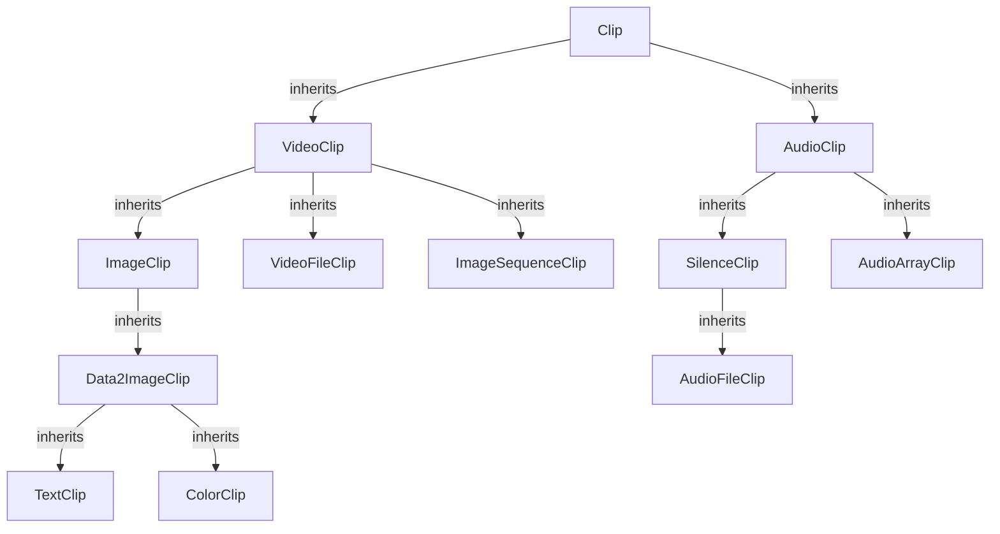
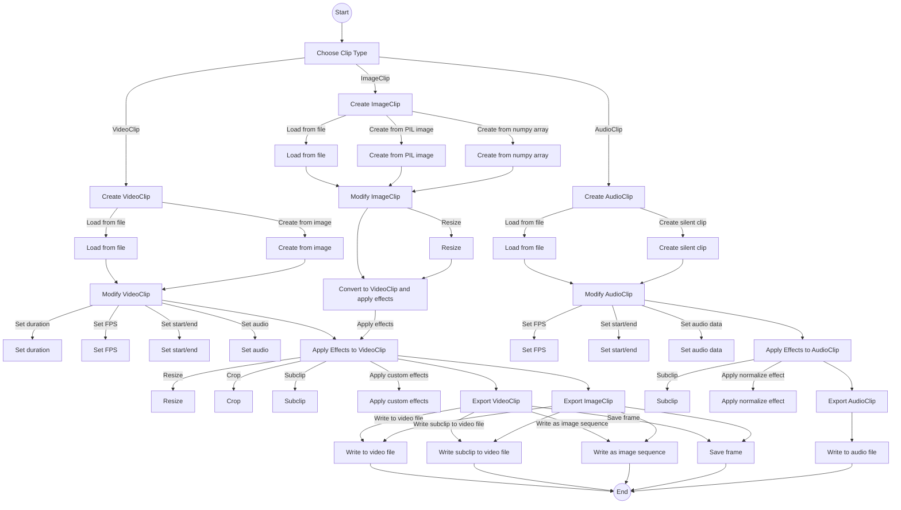

# Basic Concepts

VidioPY primarily works with two types of clips: `VideoClip` and `AudioClip`. Both are derived from the `Clip` base class and can be manipulated in various ways such as cutting, slowing down, darkening, or mixing with other clips to create new ones. These clips can then be exported to various file formats such as MP4, GIF, MP3, etc.



`VideoClip` instances can be created from a video file, an image, a text, or a custom animation, and can include an audio track, which is an `AudioClip`.

VidioPY provides numerous effects that can be applied to a clip (e.g., `clip.resize(width="360")`, `clip.subclip(t1,t2)`, or `clip.fx(vidiopy.brightness, 1.5)`). Additionally, VidioPY implements several functions (like `clip.fl_frame_transform`, `clip.fl_clip_transform`, `clip.fl_time_transform`, `clip.fx`, etc.) that make it easy to create custom effects.

## VideoClip

### Creating a VideoClip

A `VideoClip` can be created in several ways. The most common method is to load a video file using `VideoFileClip`:

```python linenums="1"
from vidiopy import VideoFileClip
clip = VideoFileClip("path/to/video.mp4")
```

A VideoClip can also be created from an image:

```python linenums="1"
from vidiopy import ImageClip
clip = ImageClip("path/to/image.png")
```

### Modifying a VideoClip

A `VideoClip` has several attributes such as fps, duration, size, audio, start, end, etc. These can be modified using the corresponding `set` methods:

```python linenums="1"
clip = clip.set_duration(10) # Not Allowed for the VideoClips only for the ImageClips
clip = clip.set_fps(24) # Should be int or float
clip = clip.set_start(5) # Use Full for the Compositing & Concatenating Video Clip. More in the Mixing clips Section
clip = clip.set_end(15) # Use Full for the Compositing & Concatenating Video Clip. More in the Mixing clips Section
audio = AudioClip("path/to/audio.mp3")
clip = clip.set_audio(audio) # Set the audio of the clip. use full for the ImageClips.
...
```

### Applying Effects to a VideoClip

Various effects can be applied to a VideoClip, including resize, crop, subclip, fx, etc.:

```python linenums="1"
clip = resize(clip, width=360) # Resize the clip to the given width
clip = crop(clip, x1=10, y1=10, x2=100, y2=100) # Crop the clip to the given dimensions
clip = clip.subclip(t1=5, t2=10) # Cut the clip to the given duration
clip = clip.fx(vidiopy.brightness, 1.5) # Apply the brightness effect to the clip
...
```

### Exporting a VideoClip

A `VideoClip` can be exported to a file using the `write_videofile` method:

```python linenums="1"
clip.write_videofile("path/to/output/video.mp4") # Write the clip to a file
clip.write_videofile_subclip("path/to/output/video.mp4", start_t=5, end_t=10) # Write the subclip to a file
clip.write_image_sequence(nformat=".png", dir="images") # Write the clip to a file as an image sequence
clip.save_frame("path/to/output/frame.png", t=5) # Save the frame of the clip to a file
```

## ImageClip

### Creating an ImageClip

An `ImageClip` can be created by loading an image file using `ImageClip` or by creating a new image using `Image.new` or a numpy array:

```python linenums="1"
from vidiopy import ImageClip
from PIL import Image
import numpy as np
clip = ImageClip("path/to/image.png", fps=24, duration=10) # Create an image clip from a file
clip2 = ImageClip(Image.new("RGB", (720, 480), (0, 0, 0)), fps=24, duration=10) # Create an image clip from a PIL image
clip3 = ImageClip(np.zeros((480, 720, 3), dtype=np.uint8), fps=24, duration=10) # Create an image clip from a numpy array
```

### applying Effects to a ImageClip

All Effects that can be applied to the `VideoClip` can be applied to the `ImageClip` but it is bit different. Some effects you can apply directly to the `ImageClip` like the Video Clip but Some Cant Directly for that you have to convert the `ImageClip` to the `VideoClip` and then apply the effect:

```python linenums="1"
from vidiopy import ImageClip
clip = ImageClip("path/to/image.png", fps=24, duration=10) # Create an image clip from a file
clip = clip.resize(width=360) # Resize the clip to the given width
clip = clip.to_video_clip() # Convert the ImageClip to the VideoClip
clip = clip.fx(accel_decel, 0.5) # Apply the accel_decel effect to the clip
```

## AudioClip

### Creating an AudioClip

An `AudioClip` can be created by loading an audio file using `AudioFileClip` or `SilenceClip`:

```python linenums="1"
from vidiopy import AudioFileClip
clip = AudioFileClip("path/to/audio.mp3") # Create an audio clip from a file Also accept video file it will extract the audio from the video file
clip = SilenceClip(duration=10) # Create a silent audio clip
```

### Modifying an AudioClip

An `AudioClip` has several attributes such as audio_data, fps, start, end, etc. These can be modified using the corresponding `set` methods:

```python linenums="1"
clip.fps = 24 # Set the fps of the clip
clip.start = 5 # Set the start time of the clip
clip.end = 15 # Set the end time of the clip
clip.audio_data = audio_data # Set the audio data of the clip
...
```

### Applying Effects to an AudioClip

An `AudioClip` has several attributes such as audio_data, fps, start, end, etc. These can be modified using the corresponding set methods:

```python linenums="1"
clip = clip.sub_clip(start=5, end=10) # Cut the clip to the given duration
clip = audio_normalize(clip) # Apply the normalize effect to the clip
...
```

### Exporting an AudioClip

An `AudioClip` can be exported to a file using the `write_audiofile` method:

```python linenums="1"
clip.write_audiofile("path/to/output/audio.mp3") # Write the clip to a file
```

## Final Flowchart


